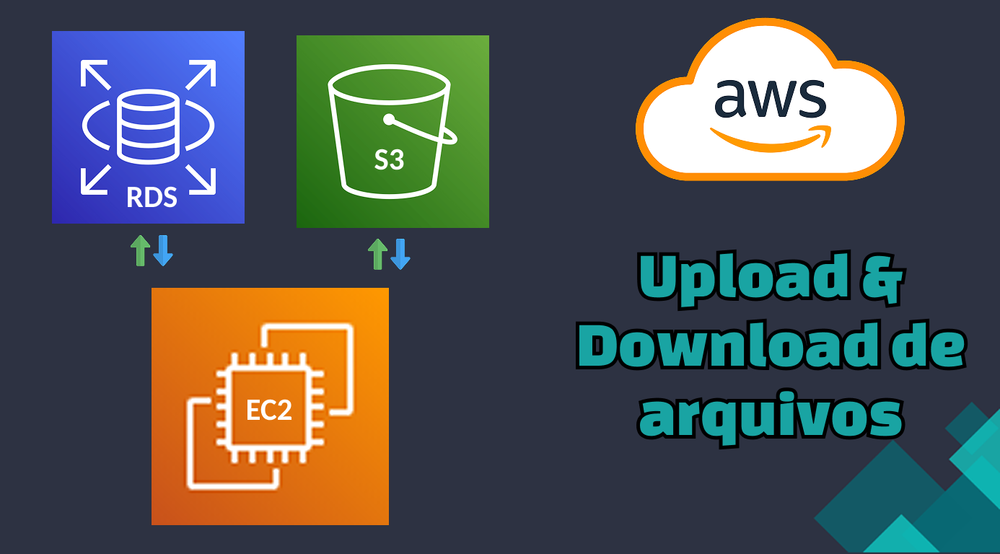

<!-- contact me -->
# Gabriel Freitas 👋

São Paulo, Brazil

<!-- contact -->

 

Olá, sou Gabriel, desenvolvedor Backend com 2 anos de experiência na criação e manutenção de sistemas. Especializado no ecossistema Java e Spring Boot, atuo com foco em Clean Code e princípios SOLID

Tenho experiência no desenvolvimento de Microserviços, Mensageria (RabbitMQ) e na infraestrutura AWS (EC2, S3, RDS). Domino o ecossistema Spring (MVC, Data, Web), Hibernate e bancos de dados PostgreSQL/MySQL. Atuo com Docker, OpenFeign, Swagger e automação de testes (TDD com JUnit/Mockito) em ambiente Linux e metodologias ágeis.

 

<!-- skills -->
<h2 align="center">Skills</h2>

 
 

<!-- My main projects-->
<h2 align="center">🖥️ Projetos</h2>

<table>
     <!-- 1 linha -->
     <tr>
      <!-- card -->
      <td>
               <a target="_self" href="https://github.com/lGabrielDev/upload_download_arquivos_S3"> 
                     
                </a>
          </td>
          <td>
               <a target="_self" href="https://github.com/lGabrielDev/projeto_rabbitMQ"> 
                     
                </a>
          </td>
          <!-- card -->
          <td>
               <a target="_self" href="https://github.com/lGabrielDev/Desafio-de-Vaga-Junior-Rocketseat"> 
                     
                </a>
          </td>
     </tr>
     <!-- 2 linha -->
     <tr>
     <!-- card -->
          <td >
               <a target="_self" href="https://github.com/lGabrielDev/microservices_concert_email"> 
                     
                </a>
          </td >
          <!-- card -->
          <td>
               <a target="_self" href="https://github.com/lGabrielDev/gerador_orcamentos"> 
                     
                </a>
          </td>
          <!-- card -->
          <td>
               <a target="_self" href="https://github.com/lGabrielDev/projeto_viaCEP"> 
                     
                </a>
          </td>
     </tr>
     <!-- row 3 -->
     <tr>
     <!-- card -->
          <td>
               <a target="_self" href="https://github.com/lGabrielDev/lGabrielDev.github.io"> 
                     
                </a>
          </td>
          <!-- card -->
          <td>
               <a target="_self" href="https://github.com/lGabrielDev/API_todoList"> 
                     
                </a>
          </td>
     </tr>
</table>

 
 

<!-- github status -->
<!-- 

    <h2>🔥 Github Status </h2>
    
    

 -->