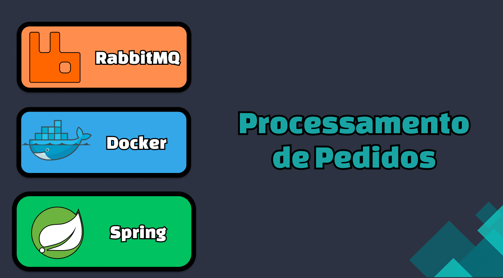
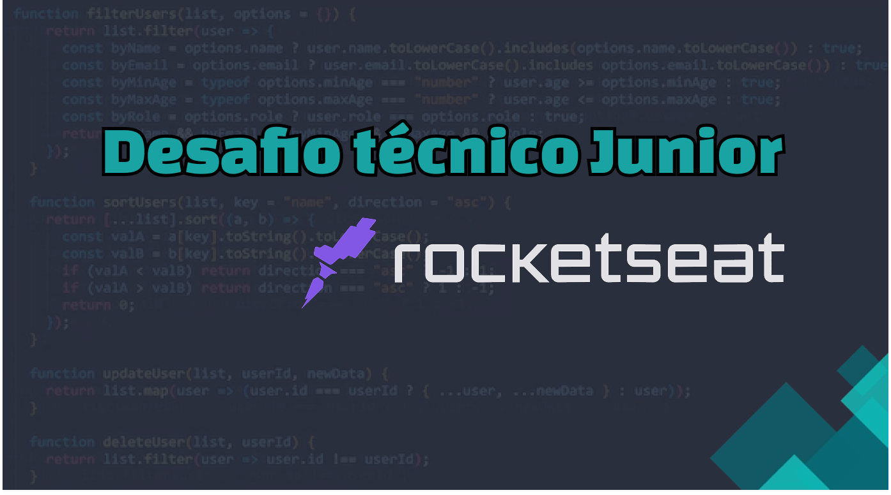
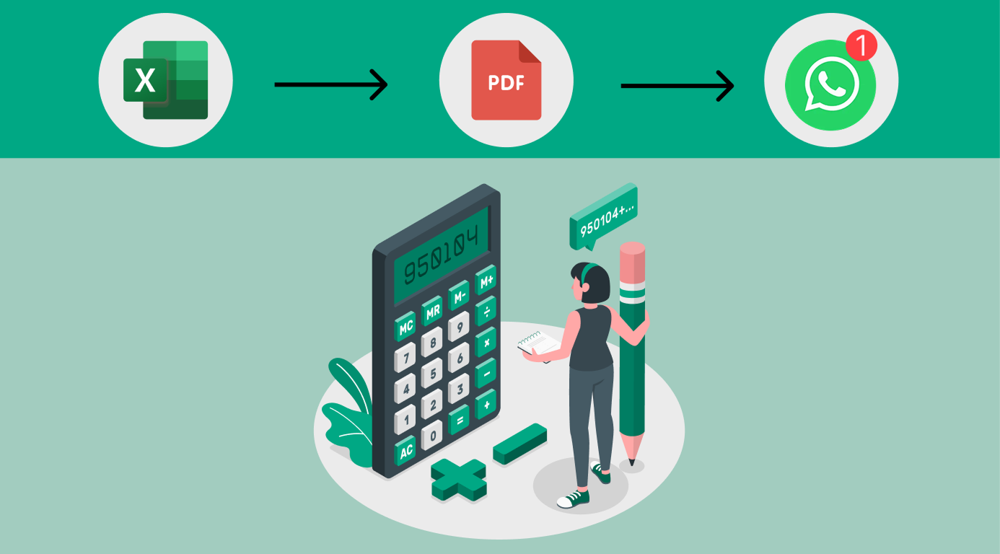

<!-- online badge -->
</img>

<!-- contact me -->
<h1 align="center">
    Gabriel Freitas 👋
</h1>

São Paulo, Brazil

<!-- contact -->

    <!-- linkedin -->
      
    <!-- portfólio -->
    <!--   -->
    <!-- gmail -->
    

 
 

<!-- skills -->
<h2 align="center">Skills</h2>

    <!-- backend -->
    
    
    
    <!-- tools -->
    
    
    

 
 

<!-- My main projects-->
<h2 align="center">🖥️ Projetos</h2>

<table>
     <!-- 1 linha -->
     <tr>
      <!-- card -->
          <td>
               <a target="_self" href="https://github.com/lGabrielDev/projeto_rabbitMQ"> 
                     
                </a>
          </td>
          <!-- card -->
          <td>
               <a target="_self" href="https://github.com/lGabrielDev/Desafio-de-Vaga-Junior-Rocketseat"> 
                     
                </a>
          </td>
     <!-- card -->
          <td >
               <a target="_self" href="https://github.com/lGabrielDev/microservices_concert_email"> 
                     
                </a>
          </td >
     </tr>
     <!-- 2 linha -->
     <tr>
          <!-- card -->
          <td>
               <a target="_self" href="https://github.com/lGabrielDev/gerador_orcamentos"> 
                     
                </a>
          </td>
          <!-- card -->
          <td>
               <a target="_self" href="https://github.com/lGabrielDev/projeto_viaCEP"> 
                     
                </a>
          </td>
     <!-- card -->
          <td>
               <a target="_self" href="https://github.com/lGabrielDev/lGabrielDev.github.io"> 
                     
                </a>
          </td>
     </tr>
     <!-- row 3 -->
     <tr>
          <!-- card -->
          <td>
               <a target="_self" href="https://github.com/lGabrielDev/API_todoList"> 
                     
                </a>
          </td>
     </tr>
</table>

 
 

<!-- My main projects-->
<h2 align="center"> 📚 Material de estudo </h2>

<table>
     <!-- 1 linha -->
     <tr>
     <!-- card -->
          <td >
               <a target="_self" href="https://github.com/lGabrielDev/learning_java"> 
                     
                </a>
          </td >
          <!-- card -->
          <td>
               <a target="_self" href="https://github.com/lGabrielDev/learning_spring"> 
                     
                </a>
          </td>
          <!-- card -->
          <td>
               <a target="_self" href="https://github.com/lGabrielDev/learning_postgreSQL"> 
                     
                </a>
          </td>
          <!-- card -->
          <td>
               <a target="_self" href="https://github.com/lGabrielDev/learning_docker"> 
                     
                </a>
          </td>
          <td>
               <a target="_self" href="https://github.com/lGabrielDev/learning_maven"> 
                     
                </a>
          </td>
     </tr>
     <!-- 2 linha -->
     <tr>
     <!-- card -->
          <td>
               <a target="_self" href="https://github.com/lGabrielDev/learning_linux"> 
                     
                </a>
          </td>
          <!-- card -->
          <td>
               <a target="_self" href="https://github.com/lGabrielDev/learning_javascript"> 
                     
                </a>
          </td>
          <!-- card -->
          <td>
               <a target="_self" href="https://github.com/lGabrielDev/learning_git"> 
                     
                </a>
          </td>
          <!-- card -->
          <td>
               <a target="_self" href="https://github.com/lGabrielDev/learning_tests/blob/main/1.introduction.md"> 
                     
                </a>
          </td>
          <!-- card -->
          <td>
               <a target="_self" href="https://github.com/lGabrielDev/learning_microservices"> 
                     
                </a>
          </td>
          </tr>
          <tr>
          </tr>
</table>

<!-- github status -->
<!-- 

    <h2>🔥 Github Status </h2>
    
    

 -->