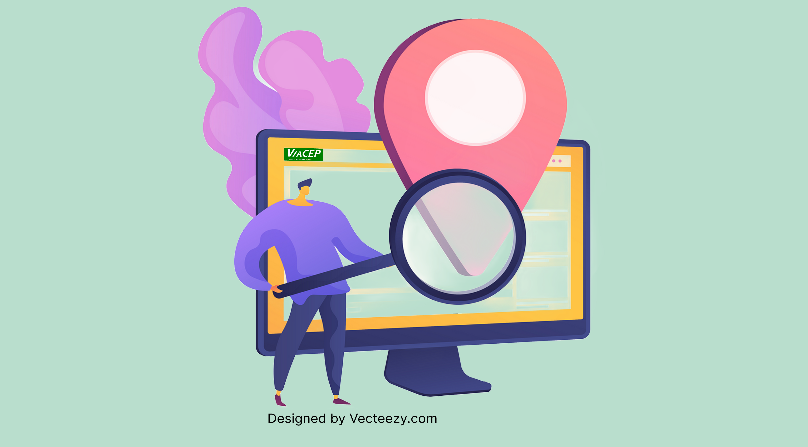

<!-- contact me -->
<h1 align="center"> Gabriel Freitas ✋ </h1>

São Paulo - SP

<!-- contact -->

     &nbsp;&nbsp;&nbsp;

 

<!-- skills -->
<h2 align="center">Skills</h2>

  <a href="https://skillicons.dev">
    
     
     
    
  </a>

 

<!-- My main projects-->
<h2 align="center">🖥️ Projetos</h2>

<table>
     <!-- 1 linha -->
     <tr>
      <!-- card -->
      <td>
               <a target="_self" href="https://github.com/lGabrielDev/upload_download_arquivos_S3"> 
                     
                </a>
          </td>
          <td>
               <a target="_self" href="https://github.com/lGabrielDev/projeto_rabbitMQ"> 
                     
                </a>
          </td>
          <!-- card -->
          <td>
               <a target="_self" href="https://github.com/lGabrielDev/Desafio-de-Vaga-Junior-Rocketseat"> 
                     
                </a>
          </td>
     </tr>
     <!-- 2 linha -->
     <tr>
     <!-- card -->
          <td >
               <a target="_self" href="https://github.com/lGabrielDev/microservices_concert_email"> 
                     
                </a>
          </td >
          <!-- card -->
          <td>
               <a target="_self" href="https://github.com/lGabrielDev/gerador_orcamentos"> 
                     
                </a>
          </td>
          <!-- card -->
          <td>
               <a target="_self" href="https://github.com/lGabrielDev/projeto_viaCEP"> 
                     
                </a>
          </td>
     </tr>
     <!-- row 3 -->
     <tr>
     <!-- card -->
          <td>
               <a target="_self" href="https://github.com/lGabrielDev/lGabrielDev.github.io"> 
                     
                </a>
          </td>
          <!-- card -->
          <td>
               <a target="_self" href="https://github.com/lGabrielDev/API_todoList"> 
                     
                </a>
          </td>
     </tr>
</table>

 
 

<!-- github status -->
<!-- 

    <h2>🔥 Github Status </h2>
    
    

 -->