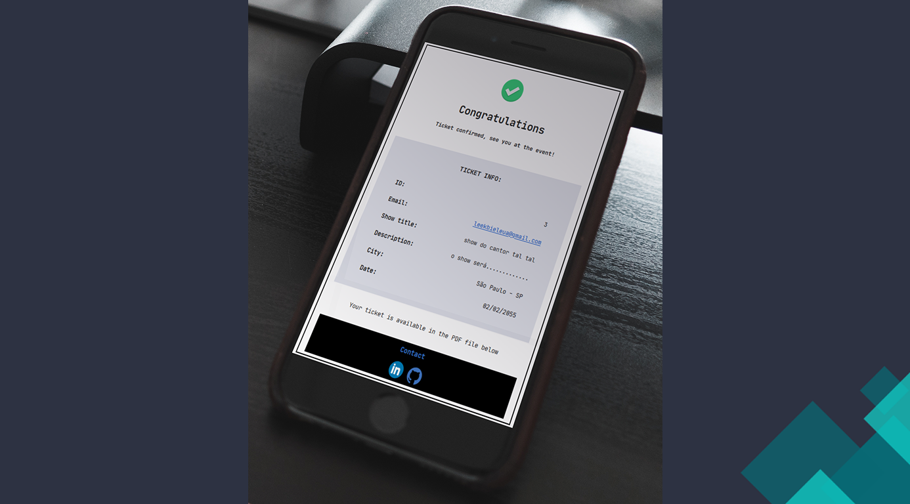

<!-- online badge -->
</img>

<!-- contact me -->
<h1 align="center">
    Gabriel Freitas 👋
</h1>

São Paulo, Brazil

<!-- contact -->

    <!-- linkedin -->
      
    <!-- portfólio -->
     
    <!-- gmail -->
    

 
 

<!-- skills -->
<h2 align="center">Skills</h2>

    <!-- backend -->
    
    
    
    <!-- tools -->
    
    
    

 
 

<!-- My main projects-->
<h2 align="center">🖥️ Main Projects</h2>

<table align="center">
    <tr>
          <!-- card 1 - ultimo projeto feito -->
          <td align="center">
            <a target="_self" href="https://github.com/lGabrielDev/microservices_concert_email"> 
                 
                
            </a>
          <!-- card 2 -->
        </td>
         <td align="center">
            <a target="_self" href="https://github.com/lGabrielDev/microservices_concert_email"> 
                 
                
            </a>
          <!-- card 2 -->
        </td>
         <td align="center">
            <a target="_self" href="https://github.com/lGabrielDev/microservices_concert_email"> 
                 
                
            </a>
          <!-- card 2 -->
    </tr>
    <!-- space -->
    <tr>
        <td> </td>
    </tr>
</table>

 

<!-- github status -->
<!-- 

    <h2>🔥 Github Status </h2>
    
    

 -->